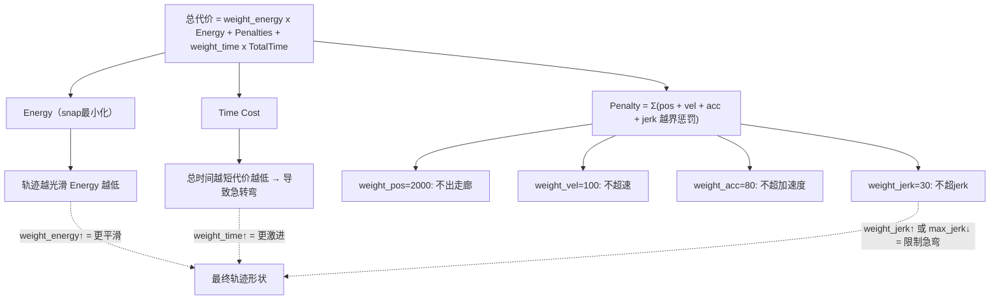

# 调整 MINCO 轨迹曲折度的参数指南

## 问题分析

MINCO 轨迹过于曲折，根源通常是以下几方面之一或组合：

1. **能量权重太低** — 优化器不够重视平滑
2. **时间权重太高** — 优化器过度压缩时间，逼迫轨迹急转弯
3. **分段太多/太短** — 每段太短导致多项式在拼接处弯折
4. **动力学约束太松** — jerk/acc 惩罚不够，允许急剧变向
5. **走廊（corridor）本身就是弯折的** — 上游路径/viewpoint 选择不合理

## 核心参数（全部硬编码在 C++ 中）

### 第一梯队：最直接影响平滑度

以下参数在 `[minco_wrapper.cpp](src/planner/proposed/forex_nav/minco/src/minco_wrapper.cpp)` 第 114-126 行设置：


| 参数                 | 当前值                         | 作用                             | 调参方向              |
| ------------------ | --------------------------- | ------------------------------ | ----------------- |
| `weight_energy`    | **0.1**（默认值，未在 wrapper 中覆盖） | MINCO 能量权重 = 平滑度的核心驱动力，越大轨迹越光滑 | **提高到 1.0~10.0**  |
| `weight_time`      | **30.0**                    | 时间最优权重，越大优化器越激进压时间             | **降低到 10.0~15.0** |
| `length_per_piece` | **2.0**（默认值，未覆盖）            | 每段多项式长度（米），越短分段越多、拼接越多         | **提高到 3.0~5.0**   |


### 第二梯队：动力学约束惩罚


| 参数            | 当前值       | 作用                | 调参方向                    |
| ------------- | --------- | ----------------- | ----------------------- |
| `weight_jerk` | **30.0**  | jerk 越界惩罚，越大轨迹越不抖 | **提高到 80~150**          |
| `weight_acc`  | **80.0**  | 加速度越界惩罚           | 可适当提高到 120~200          |
| `max_jerk`    | **15.0**  | 最大 jerk 约束        | **降低到 8.0~10.0**（限制急转弯） |
| `max_acc`     | 来自 launch | 最大加速度             | 降低也可平滑化，但会变慢            |


### 第三梯队：初始时间分配


| 参数            | 当前值             | 作用                   | 调参方向                |
| ------------- | --------------- | -------------------- | ------------------- |
| `alloc_speed` | `max_vel * 0.7` | 初始时间分配速度，越小给每段分配越多时间 | 降低到 `max_vel * 0.5` |


## 参数间关系示意




## 推荐修改方案

在 `[minco_wrapper.cpp](src/planner/proposed/forex_nav/minco/src/minco_wrapper.cpp)` 第 114-126 行：

```cpp
GCopter2D::OptConfig config;
config.max_vel = max_vel;
config.max_acc = max_acc;
config.max_jerk = 10.0;          // 15.0 → 10.0  限制急转弯
config.weight_time = 15.0;       // 30.0 → 15.0  降低时间贪心
config.weight_energy = 5.0;      // 默认0.1 → 5.0  大幅提升平滑权重（需显式设置）
config.weight_pos = 2000.0;      // 保持不变
config.weight_vel = 100.0;       // 保持不变
config.weight_acc = 100.0;       // 80.0 → 100.0  略微加强
config.weight_jerk = 100.0;      // 30.0 → 100.0  显著加强jerk惩罚
config.alloc_speed = max_vel * 0.5; // 0.7 → 0.5  给更多时间
config.smooth_eps = 0.01;        // 保持不变
config.integral_resolution = 16; // 保持不变
config.rel_cost_tol = 1e-4;      // 保持不变
config.length_per_piece = 3.0;   // 默认2.0 → 3.0  减少分段（需显式设置）
```

**关键改动 3 个**：

- `weight_energy`: 0.1 → **5.0** — 最重要，直接驱动平滑
- `weight_time`: 30.0 → **15.0** — 减轻时间贪心，不逼迫急弯
- `weight_jerk`: 30.0 → **100.0** — 惩罚抖动和急转

**辅助改动 3 个**：

- `max_jerk`: 15.0 → **10.0**
- `alloc_speed`: 0.7 → **0.5** 倍 max_vel
- `length_per_piece`: 2.0 → **3.0**（需要额外加一行，因为 wrapper 当前没设置这个字段）

## 上游因素（如果调参后仍曲折）

如果 MINCO 参数调好了仍然弯折，问题可能在上游路径选择：

- `[forex_nav_manager.cpp](src/planner/proposed/forex_nav/src/forex_nav_manager.cpp)` 中 `w_curve = 0.3` 控制 viewpoint 选择时的曲折惩罚，可提高到 0.8~1.0
- Launch 文件中 `nav/w_curve` 参数同步调整

